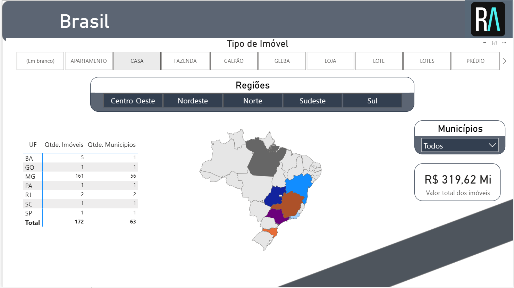
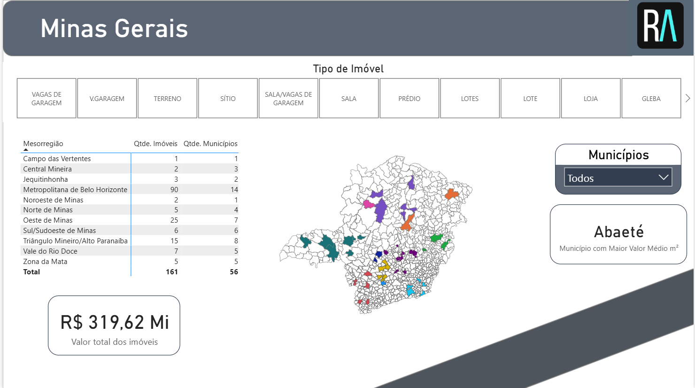

# 📊 Dashboard Imobiliário – Power BI

Este repositório contém um projeto em **Power BI** desenvolvido para análise do mercado imobiliário, com foco em imóveis distribuídos em diferentes estados e regiões do Brasil, com detalhamento para o estado de **Minas Gerais**.

O dashboard oferece uma visão consolidada dos imóveis cadastrados, permitindo filtros por tipo de imóvel, regiões, mesorregiões e municípios.

---

## 🔎 Funcionalidades

* **Análise Nacional (Brasil)**

  * Distribuição de imóveis por **UF** e regiões do país (Centro-Oeste, Nordeste, Norte, Sudeste e Sul).
  * Visualização em **mapa interativo** com destaque para os estados com imóveis registrados.
  * Filtros por **tipo de imóvel** (apartamento, casa, fazenda, galpão, gleba, lote, prédio, etc.).
  * Indicador do **valor total dos imóveis** cadastrados.

* **Análise Estadual (Minas Gerais)**

  * Detalhamento por **mesorregiões** (Metropolitana de Belo Horizonte, Triângulo Mineiro/Alto Paranaíba, Zona da Mata, entre outras).
  * Indicadores de **quantidade de imóveis** e **municípios abrangidos**.
  * Destaque para o **município com maior valor médio por m²**.
  * Visualização georreferenciada em mapa interativo.

---

## 📈 Principais Indicadores

* **Quantidade de imóveis:** 172 (Brasil), sendo 161 em Minas Gerais.
* **Municípios abrangidos:** 63 no total.
* **Valor total dos imóveis:** R\$ 319,62 milhões.
* **Município destaque:** Abaeté (MG), com o maior valor médio por m².

---

## 🗂 Estrutura do Dashboard

* **Filtros por tipo de imóvel:** Apartamento, Casa, Fazenda, Galpão, Lotes, Prédio, Loja, Gleba, etc.
* **Navegação por regiões:** Brasil → Estado → Mesorregião → Município.
* **Visualizações:**

  * Mapas temáticos (Brasil e Minas Gerais).
  * Tabelas dinâmicas com indicadores.
  * Cartões com valores consolidados.

---

## 🖼️ Imagens do Dashboard

### Brasil

### Minas Gerais

---

## 🚀 Tecnologias Utilizadas

* **Power BI** – Modelagem, visualização e interação dos dados.
* **Arquivos PBIX** – Estrutura do projeto e relatórios.

---

## 📌 Objetivo

O projeto busca fornecer uma **visão clara e interativa do mercado imobiliário**, facilitando a identificação de oportunidades, análise de concentração de imóveis e comparação entre diferentes regiões.
